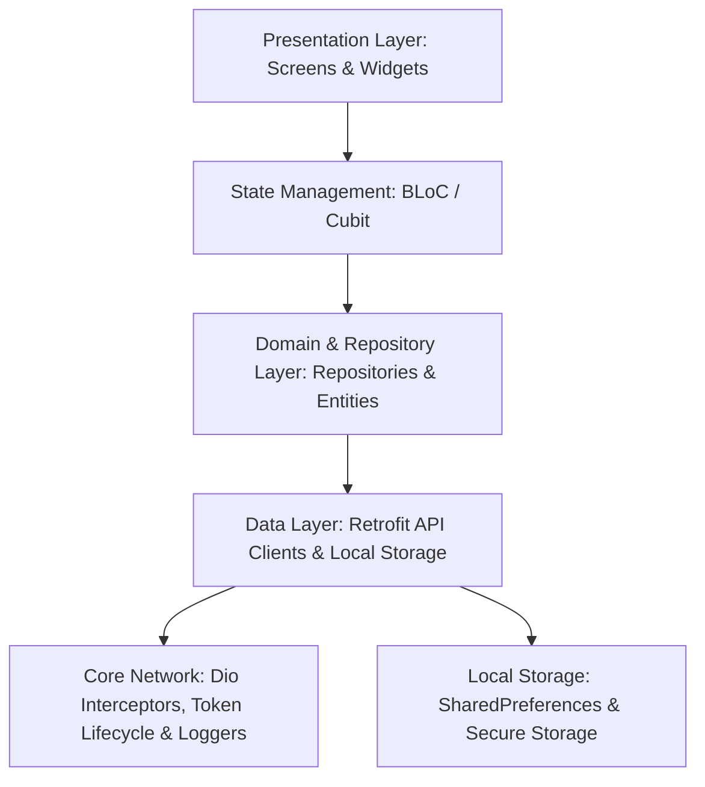
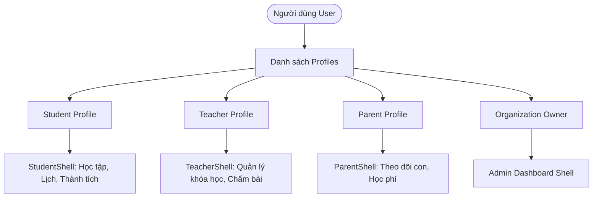
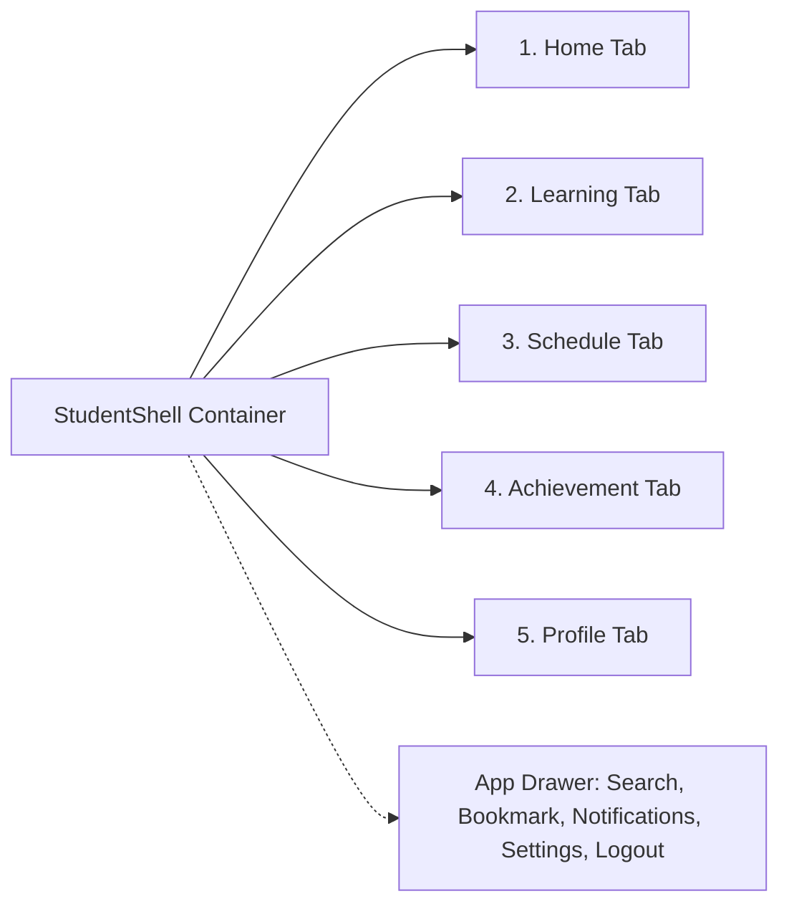
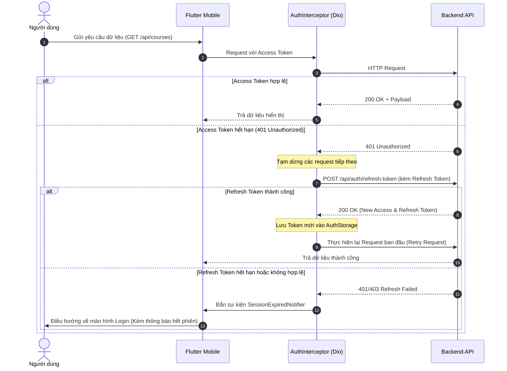

# 40Study Mobile — Tài liệu Thiết kế Hệ thống & Giao diện (Design.md)

> **Tên dự án:** 40Study Mobile (`study`)  
> **Nền tảng:** Flutter Mobile (iOS & Android)  
> **Phiên bản:** 1.0.1+1  
> **Ngôn ngữ:** Dart 3.8+ / Flutter 3.19.2+  
> **Design Philosophy:** Soft Card System — Minimal, Clean, Professional Blue & White Theme (Kế thừa Together AI Design System)

---

## 1. Tổng quan Kiến trúc Hệ thống (Architecture Overview)

Dự án áp dụng mô hình **Feature-First kết hợp Clean Architecture** nhằm đảm bảo tính phân tách trách nhiệm (Separation of Concerns), dễ mở rộng và kiểm thử độc lập.



### 1.1 Phân tầng kiến trúc (Layer Breakdown)

| Tầng (Layer) | Thư mục chính | Nhiệm vụ chính | Các công nghệ cốt lõi |
|--------------|---------------|----------------|-----------------------|
| **Core & Config** | `lib/core/`, `lib/config/`, `lib/constants/` | Thiết lập môi trường (`.env.dev`, `.env.qa`, `.env.prod`), cấu hình Logger, ánh xạ lỗi API (`DioErrorMapper`), định nghĩa kích thước & thời gian (`AppDurations`, `AppSpacing`). | `flutter_dotenv`, `talker`, `dio` |
| **Theme & Design System** | `lib/theme/` | Hệ thống thiết kế Design Tokens: Màu sắc, Typography, Corner Radius, Elevation Shadows, Spacing. | Material 3, Google Fonts (Roboto) |
| **Dependency Injection** | `lib/di/` | Khởi tạo và quản lý vòng đời Service, API Client, Repository, BLoC Provider. | `get_it`, `injectable` |
| **Data Layer** | `lib/data/`, `lib/features/*/data/` | Xử lý networking, RESTful API endpoints, DTOs, JSON Serialization, Storage. | `retrofit`, `json_annotation`, `shared_preferences` |
| **Repository Layer** | `lib/repository/`, `lib/features/*/repository/` | Abstract hóa nguồn dữ liệu, chuyển đổi DTO sang UI Models, xử lý cache/offline (nếu có). | Repository Pattern, `nullx` Result pattern |
| **Business Logic Layer** | `lib/bloc/`, `lib/features/*/bloc/` | Quản lý trạng thái giao diện theo cơ chế Reactive (Event -> State). | `flutter_bloc`, `bloc`, `equatable` |
| **Presentation Layer** | `lib/features/*/presentation/`, `lib/widgets/` | Giao diện người dùng, Components tái sử dụng, App Shell, Navigation. | Flutter Material/Cupertino Widgets, `animations`, `rive` |

---

## 2. Hệ thống Thiết kế Giao diện (Design System Specs)

Hệ thống giao diện tuân theo chuẩn **Together AI Design System - Professional Blue & White Theme**, ứng dụng mô hình **Soft Card System** tạo chiều sâu tự nhiên, độ tương phản trực quan cao mà vẫn tối giản.

### 2.1 Bảng màu (Color Palette)

#### A. Brand Colors (Sắc thái Xanh chủ đạo)
- **Brand Blue (`#2563EB`)**: Màu đại diện chính cho hệ thống, nút hành động chính (Primary CTA), biểu tượng active trên thanh điều hướng.
- **Brand Blue Dark (`#1E40AF`)**: Tiêu đề nhấn mạnh, hover/press states.
- **Brand Blue Light (`#3B82F6`)**: Banners thông báo, icon backgrounds, progress indicators.
- **Navy (`#1E3A5F`)**: Typography tiêu đề chính trên nền sáng.
- **Soft Blue (`#93C5FD`)**: Border viền nhẹ, active state background mỏng.

#### B. Blue Tints & Gradients
- `blue50` (`#EFF6FF`): Background thẻ bài học, background selected item.
- `blue100` (`#DBEAFE`): Viền thẻ thông tin nhẹ, container card headers.
- `blue200` (`#BFDBFE`): Đường phân tách, viền focus.

#### C. Neutral Palette (Slate)
- `slate50` (`#F8FAFC`): Background toàn bộ màn hình (Light mode).
- `slate100` (`#F1F5F9`): Background input text field, placeholder cards.
- `slate200` (`#E2E8F0`): Divider viền mảnh 1px cho các khối thẻ.
- `slate500` (`#64748B`): Secondary text, icon unselected, timestamp, caption.
- `slate900` (`#0F172A`): Primary text màu đen xám chuẩn cho độ đọc tốt nhất.

#### D. Semantic Colors (Trạng thái)
- **Success (`#10B981`)**: Hoàn thành bài học, nộp bài thành công, chứng chỉ đạt được.
- **Warning (`#F59E0B`)**: Bài tập sắp hết hạn, nhắc nhở lịch học.
- **Error (`#EF4444` / `#BA1A1A`)**: Sai mật khẩu, lỗi kết nối mạng, hết phiên đăng nhập.
- **Info (`#3B82F6`)**: Thông báo cập nhật hệ thống, hướng dẫn thao tác.

---

### 2.2 Typography Hierarchy

Sử dụng phông chữ tiêu chuẩn **Roboto** (Google Fonts) kết hợp font số học rõ nét:

| Token | Kích thước (Size) | Trọng số (Weight) | Chiều cao dòng (Line Height) | Mục đích sử dụng |
|-------|-------------------|-------------------|------------------------------|------------------|
| `headlineLarge` | 32px | Bold (700) | 40px | Tiêu đề Onboarding, Chào mừng lớn |
| `headlineMedium`| 24px | Bold (700) | 32px | Tiêu đề trang chính (Home, Learning, Profile) |
| `headlineSmall` | 20px | SemiBold (600) | 28px | Tiêu đề Section (Tiếp tục học, Lịch hôm nay) |
| `titleLarge` | 18px | SemiBold (600) | 24px | Tên khóa học nổi bật, Header Modal Sheet |
| `titleMedium` | 16px | Medium (500) | 24px | Tên bài học, Tiêu đề Card thông tin |
| `bodyLarge` | 16px | Regular (400) | 24px | Nội dung mô tả chi tiết khóa học |
| `bodyMedium` | 14px | Regular (400) | 20px | Đoạn văn bản chuẩn, mô tả bài tập |
| `bodySmall` | 12px | Regular (400) | 16px | Ghi chú, thời lượng video, thông số phụ |
| `labelLarge` | 14px | SemiBold (600) | 20px | Nhãn nút bấm (Primary Button Text) |
| `labelMedium` | 12px | Medium (500) | 16px | Chip danh mục, Tab filter (Đang học / Đã xong) |
| `labelSmall` | 11px | Medium (500) | 14px | Nhãn Icon Bottom Navigation Bar |

---

### 2.3 Spacing, Grid & Corner Radius

- **Hệ thống Spacing (Base 4px/8px):**
  - `xxs`: 2px | `xs`: 4px | `sm`: 8px | `md`: 12px | `lg`: 16px | `xl`: 20px | `xxl`: 24px | `xxxl`: 32px
  - `screenPadding`: 24px (Khoảng cách chuẩn lề trái/phải toàn màn hình)
  - `cardPadding`: 16px (Khoảng cách đệm chuẩn bên trong Card)
  - `sectionSpacing`: 32px (Khoảng cách giữa các nhóm chức năng lớn)
  - `listItemSpacing`: 12px (Khoảng cách giữa các item danh sách dọc)
- **Corner Radius:**
  - `Card / Sheet`: 16px (Bo góc mềm mại, hiện đại)
  - `Button / Text Field`: 12px (Dễ chạm, chuẩn công thái học)
  - `Chip / Status Tag`: 20px (Dạng viên thuốc Pill bo tròn hoàn toàn)
  - `Thumbnail Khóa học`: 8px - 12px
  - `Avatar Người dùng`: 50% (Circle hoàn toàn)
- **Đổ bóng (Elevation & Shadows):**
  - `shadowCard`: Độ mờ thấp (`Offset(0, 2)`, `BlurRadius: 8`, `Color(0x0A000000)`), tránh cảm giác nặng nề.
  - `shadowElevated`: Sử dụng cho floating controls và modal bottom sheets.
  - `shadowBlue`: Ánh sáng phát quang nhẹ cho nút CTA chính (`Color(0x332563EB)`).

---

## 3. Kiến trúc Đa vai trò (RBAC - Role-Based Architecture)

Hệ thống được thiết kế theo kiến trúc **1 Tài khoản đa Vai trò (Multi-Role Account)**:



### 3.1 Luồng xác thực & Lựa chọn vai trò (Auth & Role Picker Flow)

1. **Khởi động:** Kiểm tra trạng thái đăng nhập qua `InitBloc` -> Nếu token còn hiệu lực mở thẳng Shell, nếu không vào Login.
2. **Đăng nhập (`/api/auth/login`):**
   - Nếu tài khoản chỉ có **1 vai trò**: Nhận thẳng `access_token` & `refresh_token` -> Lưu vào `AuthStorage` -> Chuyển đến `MainScreen`.
   - Nếu tài khoản có **nhiều vai trò**: Server trả về `sessionToken` và mảng danh sách roles -> Điều hướng đến màn hình `LoginRolePickerScreen` để người dùng chọn vai trò làm việc.
3. **Dispatcher (`MainScreen`):**
   - Lắng nghe `AuthBloc.state.activeProfile.roleName`.
   - Nếu là `student`: Render `StudentShell`.
   - Nếu là `teacher`: Render `TeacherShell` (Module mở rộng).
   - Nếu là `parent`: Render `ParentShell` (Module mở rộng).
4. **Cơ chế Permission-Based UI:**
   - Client kiểm tra quyền thông qua `user.hasPermission(...)` trước khi hiển thị các nút thao tác nhạy cảm (Tạo khóa học, sửa bài học, xóa nội dung, duyệt thành viên).

---

## 4. Thiết kế Chi tiết Phân hệ Học sinh (Student Experience Specification)

Phân hệ Student là trọng tâm cốt lõi hiện tại của ứng dụng, được cấu trúc qua `StudentShell` với **5 Tab chính** và **Hệ thống điều hướng mở rộng (App Drawer & Secondary Screens)**:



### 4.1 Tab 1: Trang chủ Học tập (Home Tab)
- **Header:** Lời chào cá nhân hóa theo thời gian thực ("Chào buổi sáng, [Tên]!"), hiển thị avatar và nút mở App Drawer.
- **Continue Learning Banner (Tiếp tục học):** Card lớn nổi bật trên đầu hiển thị khóa học gần nhất đang xem dở, kèm thanh % tiến độ (ProgressBar) và nút "Tiếp tục bài học".
- **Lịch học hôm nay (Today's Timeline):** Danh sách các lớp học trực tuyến, buổi thảo luận hoặc deadline bài tập diễn ra trong ngày dưới dạng Timeline dot nối liền.
- **Bài tập cần nộp (Pending Assignments):** Liệt kê các bài tập sắp đến hạn với badge mức độ khẩn cấp (Đỏ: <24h, Vàng: <3 ngày).
- **Thống kê nhanh (Quick Stats Summary):** Số giờ đã học trong tuần, chuỗi ngày học liên tục (Streak 🔥).

### 4.2 Tab 2: Quản lý Khóa học & Tiến độ (Learning Tab)
- **Filter Bar:** Thanh chọn trạng thái hiển thị:
  - *Tất cả (All)*
  - *Đang học (In Progress)*
  - *Đã hoàn thành (Completed)*
- **Course List / Grid Card (`EnrollmentCard`):**
  - Ảnh đại diện khóa học (Cover Thumbnail 16:9).
  - Tên khóa học, tên giảng viên, số bài đã học / tổng số bài.
  - Progress bar chuyển đổi màu theo tiến độ hoàn thành.
- **Course Detail Screen (`course_detail_screen.dart`):**
  - Thông tin tổng quan: Mục tiêu khóa học, đề cương, thời lượng.
  - Accordion Sections: Danh sách các chương và bài học (`lessons`), trạng thái đã học (Checkmark xanh) / đang học / khóa.
- **Lesson Player Screen (`lesson_detail_screen.dart`):**
  - Trình phát bài giảng (Video player / Nội dung Text / Markdown).
  - File tài liệu đính kèm (PDF, Source code, Slide).
  - Nút chuyển bài trước / sau và nút hoàn thành bài học.

### 4.3 Tab 3: Lịch biểu & Lớp học (Schedule Tab)
- **Calendar Strip View:** Thanh chọn ngày/tuần trực quan có chấm chỉ báo sự kiện.
- **Timeline Schedule List:**
  - Card hiển thị từng phiên học: Thời gian bắt đầu - kết thúc, phòng học trực tuyến (Link họp / Livestream), tên môn học, giảng viên phụ trách.
  - Trạng thái phiên: Sắp diễn ra, Đang diễn ra (Live badge nhấp nháy), Đã kết thúc.

### 4.4 Tab 4: Thành tích & Chứng nhận (Achievement Tab)
- **Bảng huy hiệu (Badges Collection):** Các danh hiệu đạt được qua việc hoàn thành khóa học, duy trì streak, đạt điểm tuyệt đối bài kiểm tra.
- **Chứng chỉ số (Certificates):** Thẻ chứng chỉ hoàn thành khóa học có mã định danh, xem trước ảnh chứng chỉ chất lượng cao và tùy chọn tải về / chia sẻ.
- **Thống kê chi tiết (Learning Analytics):** Biểu đồ thời gian học tập theo tuần/tháng, số lượng bài kiểm tra đã nộp.

### 4.5 Tab 5: Hồ sơ & Bảo mật (Profile Tab)
- **Thông tin cá nhân:** Avatar, Họ tên, Email, Mã học viên, Bio cá nhân.
- **Quản lý tài khoản:** Chỉnh sửa thông tin, đổi mật khẩu, xem danh sách thiết bị đang đăng nhập (`SecurityScreen`).
- **Liên kết xã hội (Linked OAuth Accounts):** Quản lý trạng thái liên kết với Google, Facebook, Apple.
- **Cài đặt hệ thống (`SettingsScreen`):**
  - Chuyển đổi Giao diện Sáng/Tối (`ThemeMode`: Light, Dark, System).
  - Lựa chọn ngôn ngữ (`Locale`: Tiếng Việt, English, Deutsch, Português, Українська).
  - Cấu hình thông báo (Push notification, Email reminder).

---

## 5. Cấu trúc Thư mục Codebase Chuẩn (Directory Map)

```
lib/
├── app/                      # App root widget, routing configuration & listeners
├── app_runner.dart           # Khởi động binding, nạp .env, cấu hình hướng màn hình
├── main.dart                 # Điểm khởi chạy ứng dụng (Entry point theo môi trường)
├── bloc/                     # Global BLoCs (ThemeCubit, InitBloc)
├── config/                   # Cấu hình môi trường (dev, qa, prod), app constants
├── constants/                # Hằng số hệ thống (durations, animations, keys)
├── core/                     # Hạ tầng cốt lõi dùng chung
│   ├── error/                # Custom Exceptions & Failures
│   ├── logger/               # Talker AppLogger bọc chuẩn cho debug/release
│   └── network/              # Dio instance, Network interceptors, Error mapper
├── data/                     # Local Storage & Core persistence
├── di/                       # Cấu hình GetIt & Injectable modules
├── features/                 # Các phân hệ tính năng (Feature-driven)
│   ├── auth/                 # Phân hệ Xác thực & Quản lý Tài khoản
│   │   ├── bloc/             # AuthBloc, LoginCubit, RolePickerBloc...
│   │   ├── data/             # AuthApiClient (Retrofit), AuthStorage
│   │   ├── presentation/     # Screens: Login, OTP, RolePicker, Security, Account
│   │   └── repository/       # AuthRepository & AuthRepositoryImpl
│   ├── course/               # Dữ liệu & API Khóa học chung
│   ├── student/              # Phân hệ Trải nghiệm Học sinh
│   │   ├── bloc/             # HomeBloc, LearningBloc, ScheduleBloc...
│   │   ├── data/             # Models (Assignment, Badge, Schedule, Bookmark...)
│   │   ├── presentation/     # Shell & 5 Tab screens + Chi tiết bài học
│   │   └── repository/       # StudentRepository & StudentRepositoryImpl
│   ├── onboarding/           # Màn hình giới thiệu trải nghiệm đầu tiên
│   ├── main_screen.dart      # Router phân phối Shell theo Role
│   └── splash_view.dart      # Màn hình khởi động với Dot-matrix animation
├── l10n/                     # Đa ngôn ngữ (.arb files & code sinh tự động)
├── routes/                   # NavigationService & Route generator
├── theme/                    # Design System Tokens (Colors, Radius, Shadows, Spacing, Typography)
└── widgets/                  # Thư viện UI Components tái sử dụng toàn app
```

---

## 6. Vòng đời Token & Xử lý Ngoại lệ Mạng (Network & Session Lifecycle)



---

## 7. Tiêu chuẩn Đánh giá Hoàn thiện & Mở rộng (Engineering Best Practices)

1. **Hiệu năng & Tối ưu hóa (Performance):**
   - Không sử dụng `context.watch()` tại root widget gây rebuild toàn bộ cây widget; sử dụng `BlocSelector` hoặc `BlocBuilder` cục bộ tại các lá widget cần render lại.
   - Toàn bộ danh sách bài học, lịch biểu sử dụng `ListView.builder` hoặc `CustomScrollView` với `SliverList` để tối ưu hóa bộ nhớ.
2. **Bảo mật (Security):**
   - Loại bỏ hoàn toàn `print()` trong mã nguồn sản xuất; sử dụng `AppLogger` kết hợp `kDebugMode`.
   - Token xác thực và thông tin nhạy cảm của người dùng được lưu trữ an toàn.
3. **Sẵn sàng mở rộng (Scalability for Teacher & Parent Roles):**
   - Cấu trúc `StudentShell` đã tách bạch hoàn toàn với lõi ứng dụng.
   - Khi triển khai `TeacherShell` hoặc `ParentShell`, chỉ cần tạo feature module tương ứng (`features/teacher`, `features/parent`) và đăng ký nhánh trong `MainScreen` mà không gây ảnh hưởng đến logic của học sinh.
