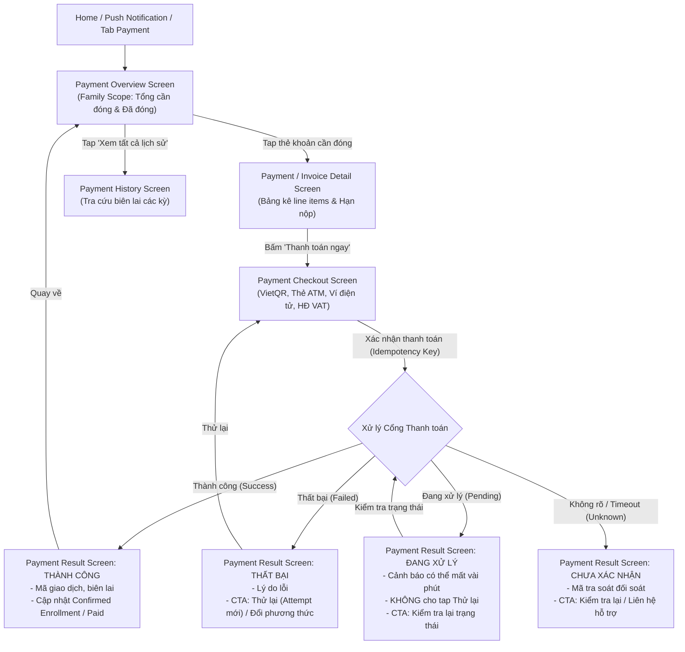

# Kế Hoạch Triển Khai UI Tab Học Phí (Payment Tab & Flow Plan — Ver 1)

> **Căn cứ tài liệu:** [`C:\Users\tungm\Downloads\deliverable.md`](file:///C:/Users/tungm/Downloads/deliverable.md) (Mục A, B, C, D, E, F, G, H)  
> **Phân hệ:** Tab Học phí (`ParentPaymentScreen` / `PaymentOverviewScreen` & luồng thanh toán phụ huynh)  
> **Nhánh Git:** `UI/Parent`  
> **Nguyên tắc cốt lõi:**  
> 1. **Family Scope**: Tab Học phí mang phạm vi toàn gia đình, không đặt `ChildSelector` ở header; mỗi khoản phí tự gắn nhãn avatar và tên của từng con.  
> 2. **Trung thực về dữ liệu**: Không suy diễn số dư, chia rõ 2 nhóm: "Khoản cần đóng" và "Khoản đã đóng kỳ này".  
> 3. **Bảo toàn giao dịch & Idempotency**: Thiết kế màn hình Checkout và Kết quả thanh toán hỗ trợ đủ 4 trạng thái (Success, Failed, Pending, Unknown); chống double-submit và ngăn chặn phụ huynh đóng tiền 2 lần.  
> 4. **Trạng thái ngoại tuyến (Offline)**: Cho phép xem dữ liệu cache nhưng vô hiệu hóa toàn bộ hành động thanh toán.  
> 5. **Chất lượng code**: Linter `flutter analyze` 0 lỗi, commit từng bước bằng tiếng Việt có dấu đầy đủ.

---

## 1. Đối Chiếu Nghiêm Ngặt Với deliverable.md

Theo đặc tả nghiệp vụ tại `deliverable.md`:

| Mục trong spec | Yêu cầu nghiệp vụ | Hiện thực hóa trong thiết kế UI Ver 1 |
|---|---|---|
| **Scope (IA - Mục A/D)** | **Family scope**: Header chỉ có tiêu đề "Học phí", KHÔNG có child selector ở top bar. | Mỗi thẻ hóa đơn mang badge tên con (`Minh · 10A1`, `Lan · 7B`). Cung cấp bộ lọc phụ (filter chips) tùy chọn theo con. |
| **Hierarchy (Mục E - Screen 18)** | 1. Tổng số tiền cần đóng (mọi con, nổi bật nhất).<br>2. Tổng đã đóng kỳ này (thông tin tham khảo).<br>3. Breakdown theo từng con.<br>4. CTA "Xem lịch sử". | 2 thẻ KPI tài chính trên cùng: **TỔNG CẦN THANH TOÁN** (to, đậm, màu cam/xanh nổi bật) và **ĐÃ ĐÓNG KỲ NÀY**. Bên dưới là danh sách thẻ hóa đơn phân nhóm. |
| **Offline State (Mục D)** | Vô hiệu hóa mọi hành động thanh toán khi offline, vẫn cho xem dữ liệu từ cache. | Banner thông báo ngoại tuyến, nút `Thanh toán ngay` và `Pay now` bị disabled kèm tooltip giải thích. |
| **Detail Screen (Mục E - Screen 19)** | Chi tiết line items cấu thành, hạn nộp, trạng thái, sticky CTA dưới cùng. | Bảng kê minh bạch: Học phí chính khóa, giáo trình, phụ phí, ưu đãi/học bổng giảm trừ, tổng tiền cuối cùng. |
| **Checkout (Mục E - Screen 20)** | Chọn phương thức thanh toán, tóm tắt khoản đóng, bước xác nhận trước khi submit, chống double-tap. | Hỗ trợ 4 phương thức phổ biến (VietQR Napas247, Thẻ ATM/iBanking, Ví điện tử MoMo/ZaloPay/VNPay, Thẻ Visa/Mastercard) + Tùy chọn xuất HĐĐT (VAT). |
| **Payment Result (Mục E - Screen 21)** | Xử lý 4 trạng thái chuẩn: Thành công, Thất bại, Đang xử lý (Pending), Không rõ (Unknown). Áp dụng quy tắc Idempotency. | Giao diện chuyên biệt cho từng trạng thái: Pending KHÔNG có nút "Thử lại" (chống trùng giao dịch); Unknown có mã tra soát và liên hệ hỗ trợ. |
| **Payment History (Mục E - Screen 22)** | Tra cứu lịch sử đã đóng, lọc theo con/kỳ học, tải biên lai/hóa đơn cũ. | Danh sách các giao dịch thành công trong quá khứ kèm mã hóa đơn và nút xem/tải biên lai PDF. |

---

## 2. Phân Tích Thiết Kế Trong Ảnh Đính Kèm (Design Review & Gap Analysis)

Ảnh thiết kế do người dùng cung cấp thể hiện màn hình **Chi tiết khoản thu (Screen 19: Payment/Invoice Detail)** trong trạng thái **Đã quá hạn**.

### 2.1. Phân Tích Các Thành Phần Trong Ảnh Thiết Kế:
1. **Header:** Nút Back (`<`), nhãn kỹ thuật `FAMILY SCOPE`, tiêu đề `Chi tiết khoản thu`, nút Share (`share_outlined`).
2. **Hero Block Tài chính:**
   - Pill cảnh báo: `• ĐÃ QUÁ HẠN (5 NGÀY)` (nền đỏ nhạt, chữ đỏ `0xFFDC2626`).
   - Nhãn: `TỔNG TIỀN CẦN THANH TOÁN`.
   - Số tiền nổi bật: `1.400.000 đ` (cỡ chữ 32pt, in đậm, màu đen `0xFF0F172A`).
   - Mã hóa đơn: `#INV-2026-06-M01` kèm icon Copy màu xanh dương.
3. **Khối Thông Tin Khóa Học:**
   - Học sinh: `Nguyễn Nhật Minh (10A1)` (định danh con và lớp rõ ràng).
   - Khóa học: `Toán học nâng cao & Luyện đề`.
   - Giáo viên phụ trách: `ThS. Hoàng Minh Tuấn`.
   - Thời lượng: `12 buổi (Tháng 6/2026)`.
   - Hạn thanh toán: `15/06/2026` (màu đỏ cảnh báo do đã quá hạn).
4. **Khối Chi Tiết Chi Phí (Line-item Breakdown):**
   - Học phí gốc (12 buổi): `1.600.000 đ`.
   - Ưu đãi học bổng chăm chỉ (10%): `-200.000 đ` (màu xanh lá `0xFF16A34A` kèm icon checkmark).
   - Đường phân cách mảnh.
   - Dòng tổng kết: `Số tiền cần thanh toán`: `1.400.000 đ` (màu đỏ in đậm).
5. **Khối Hóa Đơn Điện Tử (VAT):**
   - Box PDF: `Xem & Tải hóa đơn điện tử (VAT) - Định dạng PDF đã ký số điện tử` kèm mũi tên điều hướng.
6. **Khối Lưu Ý Chính Sách Trung Tâm:**
   - Box cảnh báo màu vàng nhạt `0xFFFFFBEB` kèm icon `Icons.warning_amber_rounded`:  
     *"Lưu ý: Học sinh có thể bị tạm ngưng tham gia các buổi học tương tác nếu học phí quá hạn quá 7 ngày. Phụ huynh vui lòng hoàn tất sớm để đảm bảo việc học của con."*
7. **Khối Sticky Action Bar Ở Đáy:**
   - Tóm tắt bên trái: `CẦN THANH TOÁN: 1.400.000 đ`.
   - Nút hành động chính bên phải: `Thanh toán ngay →` (ElevatedButton màu xanh dương `0xFF2563EB`, icon mũi tên trắng).

---

### 2.2. Đánh Giá Ưu Điểm:
1. **Trực quan hóa tài chính xuất sắc:** Số tiền cần đóng được làm nổi bật ngay lập tức ở cả vị trí Hero đầu trang lẫn Sticky bar cố định dưới chân màn hình, phụ huynh nắm bắt tức thì mà không cần tìm kiếm.
2. **Minh bạch hóa dòng tiền (Line-item Transparency):** Thể hiện rõ học phí gốc và khoản giảm trừ học bổng `-200.000 đ` bằng màu xanh lá có tick tròn. Điều này tạo tâm lý tích cực, ghi nhận sự nỗ lực học tập của con và sự ghi nhận từ trung tâm.
3. **Tính thực tế cao:** Tích hợp sẵn nút copy mã hóa đơn `#INV-2026-06-M01` (rất hữu ích khi phụ huynh chuyển khoản ngân hàng cần dán mã giao dịch) và khối xem/tải hóa đơn GTGT PDF có chữ ký số điện tử (cần thiết cho phụ huynh quyết toán doanh nghiệp).
4. **Cảnh báo sư phạm & vận hành đúng mực:** Nhắc nhở quy chế "ngưng buổi học tương tác nếu quá hạn 7 ngày" vừa mang tính thúc đẩy hoàn tất nghĩa vụ học phí vừa giữ được sự văn minh, không mang tính chất đòi nợ gay gắt.

---

### 2.3. Nhược Điểm & Khoảng Trống (Gaps) Cần Chuẩn Hóa Theo deliverable.md:
1. **Nhãn nhầm lẫn `FAMILY SCOPE` trên Header:**
   - *Vấn đề:* Header trong ảnh có dòng text kỹ thuật `FAMILY SCOPE`. Tuy nhiên, đây là nhãn phân loại kiến trúc của tài liệu thiết kế. Khi hiển thị cho phụ huynh, dòng chữ này gây khó hiểu.
   - *Giải pháp:* Thay bằng subtitle thân thiện hơn hoặc khóa ngữ cảnh con: `Học phí · Minh (10A1)` (đúng quy tắc Locked child context tại màn hình Detail theo mục A & E của `deliverable.md`).
2. **Chưa xử lý trạng thái Ngoại tuyến (Offline Guardrail):**
   - *Vấn đề:* Mục D & E của `deliverable.md` quy định nghiêm ngặt: Khi offline, phụ huynh vẫn được xem thông tin hóa đơn từ cache, nhưng **tuyệt đối vô hiệu hóa nút thanh toán** (disabled) để tránh lỗi phát sinh giao dịch ma.
   - *Giải pháp:* Khi mất kết nối mạng, hiển thị banner cảnh báo ngoại tuyến ở đầu trang, đồng thời nút `Thanh toán ngay` chuyển sang trạng thái disabled màu xám kèm thông báo "Vui lòng kết nối Internet để thanh toán".
3. **Chưa thể hiện trạng thái khi hóa đơn ĐÃ THANH TOÁN (Paid State):**
   - *Vấn đề:* Ảnh chỉ thể hiện trạng thái `ĐÃ QUÁ HẠN`. Khi phụ huynh mở lại một hóa đơn đã đóng từ trước (hoặc sau khi thanh toán thành công), giao diện cần phản hồi đúng trạng thái.
   - *Giải pháp:* Thiết kế biến thể trạng thái `Đã thanh toán`:
     - Tag trạng thái chuyển thành `• ĐÃ THANH TOÁN` (màu xanh lá `0xFF16A34A`).
     - Dòng hạn nộp chuyển thành `Ngày thanh toán: 12/06/2026 (Qua VietQR)`.
     - Ẩn box cảnh báo ngưng học.
     - Nút sticky đáy chuyển thành `[ Tải biên lai thu tiền ]` hoặc `[ Xem lịch sử giao dịch ]`.
4. **Thiếu kênh trợ giúp / Trao đổi với Kế toán khi có thắc mắc:**
   - *Vấn đề:* Khi khoản phí bị quá hạn hoặc có sai sót về số buổi, phụ huynh có nhu cầu liên hệ nhân viên học vụ/kế toán để xác minh hoặc xin chia kỳ đóng phí.
   - *Giải pháp:* Thêm nút phụ hoặc link text `Cần hỗ trợ về khoản thu? Liên hệ bộ phận kế toán` mở trực tiếp BottomSheet hỗ trợ (gọi hotline hoặc nhắn tin hỗ trợ).

---

## 3. Luồng Người Dùng (User Flows & State Transitions)



---

## 4. Kiến Trúc Thư Mục & Phân Hệ Mã Nguồn

```text
lib/features/parent/
├── data/models/
│   ├── parent_payment_model.dart              <-- InvoiceItem, PaymentMethod, PaymentResultModel, PaymentHistoryModel
│   └── models.dart                            <-- Export payment models
├── repository/
│   ├── parent_payment_repository.dart         <-- Interface: getInvoices, getInvoiceDetail, checkout, checkPaymentStatus, getHistory
│   └── parent_payment_repository_impl.dart    <-- Mock data chuẩn hóa cho gia đình Minh & Lan
└── presentation/payment/
    ├── parent_payment_screen.dart             <-- Root screen: Payment Overview
    ├── payment_invoice_detail_screen.dart     <-- Màn hình chi tiết hóa đơn & line items
    ├── payment_checkout_screen.dart           <-- Màn hình chọn phương thức & thanh toán
    ├── payment_result_screen.dart             <-- Màn hình kết quả giao dịch (4 trạng thái)
    ├── payment_history_screen.dart            <-- Màn hình lịch sử giao dịch đã đóng
    └── widgets/
        ├── payment_summary_cards.dart         <-- 2 Card KPI: Tổng cần thanh toán & Đã đóng
        ├── invoice_item_card.dart             <-- Thẻ khoản phí hiển thị tên con, số tiền, hạn nộp
        ├── payment_method_selector.dart       <-- Bộ chọn phương thức (VietQR, Thẻ, Ví, Quốc tế)
        ├── vietqr_display_card.dart           <-- Khối hiển thị mã QR động VietQR ngân hàng
        ├── vat_invoice_form.dart              <-- Khối nhập thông tin xuất hóa đơn GTGT
        └── payment_empty_card.dart            <-- Trạng thái rỗng không có khoản nợ
```

---

## 5. Chi Tiết Kế Hoạch Triển Khai (Phased Roadmap)

### Giai đoạn 1: Data Models & Payment Repository
- [ ] **Bước 1.1: Tạo `parent_payment_model.dart`:**
  - Enum `PaymentInvoiceStatus`: `unpaid`, `dueSoon`, `overdue`, `paid`, `processing`.
  - Enum `PaymentMethodType`: `vietQr`, `atmCard`, `eWallet`, `creditCard`.
  - Enum `PaymentTransactionStatus`: `success`, `failed`, `pending`, `unknown`.
  - Model `InvoiceLineItem`: Tên mục, đơn giá, số lượng, giảm trừ, thành tiền.
  - Model `ParentInvoiceModel`: ID hóa đơn, childId, childName, className, tiêu đề, mã hóa đơn, ngày phát hành, hạn thanh toán, tổng tiền, danh sách line items, trạng thái.
  - Model `PaymentSummaryOverviewModel`: Tổng tiền cần đóng, số khoản cần đóng, tổng tiền đã đóng kỳ này.
  - Model `PaymentTransactionResult`: Mã giao dịch, invoiceId, childName, số tiền, trạng thái kết quả, thời gian, thông báo lỗi nếu có.
- [ ] **Bước 1.2: Định nghĩa `ParentPaymentRepository` & Implementation:**
  - `Future<PaymentSummaryOverviewModel> getPaymentSummary();`
  - `Future<List<ParentInvoiceModel>> getInvoices({String? childId, PaymentInvoiceStatus? status});`
  - `Future<ParentInvoiceModel?> getInvoiceDetail(String invoiceId);`
  - `Future<PaymentTransactionResult> submitPayment({required String invoiceId, required PaymentMethodType method, String? idempotencyKey, Map<String, dynamic>? vatInfo});`
  - `Future<PaymentTransactionResult> checkPaymentStatus(String transactionId);`
  - `Future<List<ParentInvoiceModel>> getPaymentHistory({String? childId, int? year});`
  - Mock data cho Minh (1 khoản Toán cần nộp gấp, 1 khoản STEM đã đóng) và Lan (1 khoản Tiếng Anh sắp đến hạn).

### Giai đoạn 2: Xây dựng Màn hình Tổng quan Học phí (`PaymentOverviewScreen`)
- [ ] **Bước 2.1: Header Family Scope:**
  - Tiêu đề "Học phí & Thanh toán", không có child selector.
  - Nút biểu tượng Lịch sử thanh toán trên AppBar dẫn tới `PaymentHistoryScreen`.
- [ ] **Bước 2.2: 2 Thẻ KPI Tài chính (`PaymentSummaryCards`):**
  - Thẻ 1 (Trọng tâm): **TỔNG CẦN THANH TOÁN** (nổi bật, số tiền lớn, số khoản cần đóng).
  - Thẻ 2: **ĐÃ ĐÓNG KỲ NÀY** (thông tin tham khảo).
- [ ] **Bước 2.3: Thanh lọc phụ (Filter bar):**
  - Chip lọc theo con: `Tất cả con`, `Minh (10A1)`, `Lan (7B)`.
  - Chip lọc trạng thái: `Cần thanh toán`, `Đã thanh toán`.
- [ ] **Bước 2.4: Danh sách `InvoiceItemCard`:**
  - Hiển thị badge avatar con, tên con + lớp.
  - Tên học phần, hạn nộp, badge trạng thái (`Cần nộp gấp`, `Quá hạn`, `Đã đóng`).
  - Số tiền và nút `Thanh toán ngay` (mở Checkout) hoặc `Chi tiết` (mở Invoice Detail).
- [ ] **Bước 2.5: Trạng thái Empty & Offline:**
  - Khi không có khoản nợ: Hiện card All-clear "Tuyệt vời! Gia đình không có khoản phí nào cần đóng".
  - Khi offline: Hiện banner ngoại tuyến, vô hiệu hóa nút thanh toán.

### Giai đoạn 3: Xây dựng Màn hình Chi tiết Hóa đơn (`PaymentInvoiceDetailScreen`)
- [ ] **Bước 3.1: Header & Chuẩn hóa ngữ cảnh con:**
  - Header có nút Back (`<`) và nút Share (`share_outlined`).
  - Loại bỏ nhãn kỹ thuật `FAMILY SCOPE`, thay bằng subtitle thân thiện: `Học phí · Minh (10A1)` (Locked Child Context theo mục A & E `deliverable.md`).
- [ ] **Bước 3.2: Hero Block Tài chính & Mã hóa đơn:**
  - Tag trạng thái: `• ĐÃ QUÁ HẠN (X NGÀY)` (đỏ) hoặc `• SẮP TỚI HẠN` (vàng) hoặc `• ĐÃ THANH TOÁN` (xanh).
  - Nhãn `TỔNG TIỀN CẦN THANH TOÁN` và số tiền cực lớn (`1.400.000 đ`).
  - Mã hóa đơn bo pill `#INV-2026-06-M01` kèm icon Copy clipboard tiện lợi.
- [ ] **Bước 3.3: Khối Thông tin Khóa học & Bảng kê Chi phí Minh bạch (Line-item Transparency):**
  - Thông tin: Học sinh, Khóa học, Giáo viên phụ trách, Thời lượng (12 buổi).
  - Bảng kê chi phí: Học phí gốc (12 buổi) `1.600.000 đ`, Ưu đãi học bổng chăm chỉ (10%) `-200.000 đ` (màu xanh lá có icon checkmark).
  - Dòng tổng kết số tiền cần thanh toán.
- [ ] **Bước 3.4: Khối Hóa đơn Điện tử (VAT) & Box Lưu ý Chính sách Trung tâm:**
  - Khối PDF: `Xem & Tải hóa đơn điện tử (VAT) - Định dạng PDF đã ký số điện tử` (mở PDF preview hoặc tải về).
  - Box lưu ý chính sách màu vàng nhạt: Cảnh báo tạm ngưng học tương tác nếu quá hạn quá 7 ngày.
  - Link hỗ trợ: `Cần hỗ trợ về khoản thu? Liên hệ kế toán` mở BottomSheet hỗ trợ.
- [ ] **Bước 3.5: Sticky Action Bar & Offline Guardrail:**
  - Tóm tắt bên trái: `CẦN THANH TOÁN: 1.400.000 đ`.
  - Nút bên phải: `Thanh toán ngay →` (chuyển sang màn Checkout).
  - Xử lý trạng thái ngoại tuyến (Offline): Khi mất mạng, nút bị disabled kèm banner thông báo ngoại tuyến theo đúng spec.
  - Xử lý khi hóa đơn đã đóng: Nút đổi thành `[ Tải biên lai thu tiền ]`.

### Giai đoạn 4: Xây dựng Màn hình Checkout (`PaymentCheckoutScreen`)
- [ ] **Bước 4.1: Tóm tắt thông tin khoản đóng:**
  - Tên con, tên lớp, số tiền phải trả.
- [ ] **Bước 4.2: Bộ chọn phương thức thanh toán (`PaymentMethodSelector`):**
  - VietQR Napas247 (chuyển khoản ngân hàng tức thì với QR động).
  - Thẻ ATM nội địa / Internet Banking.
  - Ví điện tử MoMo / ZaloPay / VNPay.
  - Thẻ quốc tế Visa / Mastercard.
- [ ] **Bước 4.3: Khối VietQR tương tác (`VietQrDisplayCard`):**
  - Hiển thị mã QR ngân hàng chuẩn VietQR.
  - Thông tin số tài khoản, tên chủ tài khoản, ngân hàng, số tiền, cú pháp chuyển tiền tự động.
  - Nút "Tải mã QR về máy" và nút "Sao chép số tài khoản / nội dung".
- [ ] **Bước 4.4: Khối Tùy chọn Xuất hóa đơn GTGT (`VatInvoiceForm`):**
  - Toggle "Yêu cầu xuất hóa đơn công ty (VAT)".
  - Các ô nhập: Tên công ty, Mã số thuế, Địa chỉ, Email nhận HĐĐT.
- [ ] **Bước 4.5: Cơ chế Idempotency & Sticky Submit:**
  - Khóa nút, hiển thị spinner khi bấm thanh toán, ngăn submit 2 lần.
  - Chuyển hướng sang màn hình Kết quả (`PaymentResultScreen`).

### Giai đoạn 5: Xây dựng Màn hình Kết quả Thanh toán (`PaymentResultScreen`)
- [ ] **Bước 5.1: Xử lý 4 trạng thái chuẩn xác:**
  - **Trạng thái 1: Thành công (Success)** $\rightarrow$ Icon xanh, thông tin giao dịch, CTA `Về trang Học phí` hoặc `Xem biên lai`.
  - **Trạng thái 2: Thất bại (Failed)** $\rightarrow$ Icon đỏ, lý do lỗi, CTA `Thử lại` (tạo attempt mới liên kết attempt cũ) hoặc `Đổi phương thức`.
  - **Trạng thái 3: Đang xử lý (Pending)** $\rightarrow$ Icon đồng hồ cát, thông báo giao dịch đang xử lý, KHÔNG CÓ nút thử lại, chỉ có CTA `Kiểm tra lại trạng thái`.
  - **Trạng thái 4: Chưa xác nhận (Unknown/Timeout)** $\rightarrow$ Mã giao dịch tra soát, CTA `Kiểm tra lại` và `Liên hệ hỗ trợ`.

### Giai đoạn 6: Xây dựng Màn hình Lịch sử Thanh toán (`PaymentHistoryScreen`)
- [ ] **Bước 6.1: Bộ lọc Lịch sử:**
  - Lọc theo con (Tất cả, Minh, Lan) và theo năm học (2024–2025).
- [ ] **Bước 6.2: Danh sách giao dịch hoàn thành:**
  - Thẻ giao dịch hiển thị mã hóa đơn, tên con, ngày thanh toán, số tiền, phương thức.
  - Nút xem chi tiết biên lai và tải file PDF điện tử.

### Giai đoạn 7: Tích hợp Toàn diện & Nghiệm thu Kỹ thuật
- [ ] **Bước 7.1: Đấu nối vào `ParentShell`:** Thay thế placeholder hiện tại bằng `ParentPaymentScreen`.
- [ ] **Bước 7.2: Đấu nối từ `ParentHomeScreen`:** Alert thanh toán quá hạn trên Home tap thẳng vào `PaymentInvoiceDetailScreen`.
- [ ] **Bước 7.3: Kiểm tra chất lượng code:** `flutter analyze` 0 issues (0 lỗi, 0 cảnh báo).
- [ ] **Bước 7.4: Commit theo từng bước bằng tiếng Việt có dấu đầy đủ**, không push lên remote khi chưa có yêu cầu.

---

## 6. Tiêu Chí Nghiệm Thu (Acceptance Criteria)

| Tiêu chí | Điều kiện Đạt (PASS) |
|---|---|
| **Tuân thủ Family Scope** | Không có dropdown chọn con ở header tab Học phí; mỗi thẻ tự hiển thị tên và avatar của con tương ứng. |
| **Tính chân thực của số liệu** | Hiển thị rõ ràng 2 số tổng: Tổng cần thanh toán (của mọi con) và Tổng đã đóng kỳ này; phân loại chuẩn xác trạng thái quá hạn / sắp đến hạn. |
| **Bảo toàn Idempotency** | Không có tình trạng tap đúp nút thanh toán; màn hình Pending không hiển thị nút thử lại thanh toán; mã attempt được lưu vết rõ ràng. |
| **Hỗ trợ VietQR thực tế** | Có mã QR động, sao chép nhanh STK và cú pháp chuyển tiền mang mã hóa đơn. |
| **Chất lượng mã nguồn** | Không có lỗi compile, không có cảnh báo analyzer, responsive trên mọi kích thước màn hình. |
