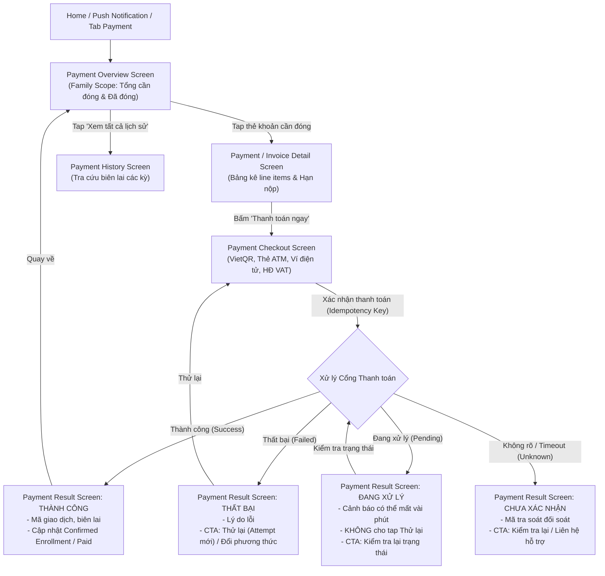

# Kế Hoạch Triển Khai UI Tab Học Phí (Payment Tab & Flow Plan — Ver 1)

> **Căn cứ tài liệu:** [`C:\Users\tungm\Downloads\deliverable.md`](file:///C:/Users/tungm/Downloads/deliverable.md) (Mục A, B, C, D, E, F, G, H)  
> **Phân hệ:** Tab Học phí (`ParentPaymentScreen` / `PaymentOverviewScreen` & luồng thanh toán phụ huynh)  
> **Nhánh Git:** `UI/Parent`  
> **Nguyên tắc cốt lõi:**  
> 1. **Family Scope**: Tab Học phí mang phạm vi toàn gia đình, không đặt `ChildSelector` ở header; mỗi khoản phí tự gắn nhãn avatar và tên của từng con.  
> 2. **Trung thực về dữ liệu**: Không suy diễn số dư, chia rõ 2 nhóm: "Khoản cần đóng" và "Khoản đã đóng kỳ này".  
> 3. **Bảo toàn giao dịch & Idempotency**: Thiết kế màn hình Checkout và Kết quả thanh toán hỗ trợ đủ 4 trạng thái (Success, Failed, Pending, Unknown); chống double-submit và ngăn chặn phụ huynh đóng tiền 2 lần.  
> 4. **Trạng thái ngoại tuyến (Offline)**: Cho phép xem dữ liệu cache nhưng vô hiệu hóa toàn bộ hành động thanh toán.  
> 5. **Chất lượng code**: Linter `flutter analyze` 0 lỗi, commit từng bước bằng tiếng Việt có dấu đầy đủ.

---

## 1. Đối Chiếu Nghiêm Ngặt Với deliverable.md

Theo đặc tả nghiệp vụ tại `deliverable.md`:

| Mục trong spec | Yêu cầu nghiệp vụ | Hiện thực hóa trong thiết kế UI Ver 1 |
|---|---|---|
| **Scope (IA - Mục A/D)** | **Family scope**: Header chỉ có tiêu đề "Học phí", KHÔNG có child selector ở top bar. | Mỗi thẻ hóa đơn mang badge tên con (`Minh · 10A1`, `Lan · 7B`). Cung cấp bộ lọc phụ (filter chips) tùy chọn theo con. |
| **Hierarchy (Mục E - Screen 18)** | 1. Tổng số tiền cần đóng (mọi con, nổi bật nhất).<br>2. Tổng đã đóng kỳ này (thông tin tham khảo).<br>3. Breakdown theo từng con.<br>4. CTA "Xem lịch sử". | 2 thẻ KPI tài chính trên cùng: **TỔNG CẦN THANH TOÁN** (to, đậm, màu cam/xanh nổi bật) và **ĐÃ ĐÓNG KỲ NÀY**. Bên dưới là danh sách thẻ hóa đơn phân nhóm. |
| **Offline State (Mục D)** | Vô hiệu hóa mọi hành động thanh toán khi offline, vẫn cho xem dữ liệu từ cache. | Banner thông báo ngoại tuyến, nút `Thanh toán ngay` và `Pay now` bị disabled kèm tooltip giải thích. |
| **Detail Screen (Mục E - Screen 19)** | Chi tiết line items cấu thành, hạn nộp, trạng thái, sticky CTA dưới cùng. | Bảng kê minh bạch: Học phí chính khóa, giáo trình, phụ phí, ưu đãi/học bổng giảm trừ, tổng tiền cuối cùng. |
| **Checkout (Mục E - Screen 20)** | Chọn phương thức thanh toán, tóm tắt khoản đóng, bước xác nhận trước khi submit, chống double-tap. | Hỗ trợ 4 phương thức phổ biến (VietQR Napas247, Thẻ ATM/iBanking, Ví điện tử MoMo/ZaloPay/VNPay, Thẻ Visa/Mastercard) + Tùy chọn xuất HĐĐT (VAT). |
| **Payment Result (Mục E - Screen 21)** | Xử lý 4 trạng thái chuẩn: Thành công, Thất bại, Đang xử lý (Pending), Không rõ (Unknown). Áp dụng quy tắc Idempotency. | Giao diện chuyên biệt cho từng trạng thái: Pending KHÔNG có nút "Thử lại" (chống trùng giao dịch); Unknown có mã tra soát và liên hệ hỗ trợ. |
| **Payment History (Mục E - Screen 22)** | Tra cứu lịch sử đã đóng, lọc theo con/kỳ học, tải biên lai/hóa đơn cũ. | Danh sách các giao dịch thành công trong quá khứ kèm mã hóa đơn và nút xem/tải biên lai PDF. |

---

## 2. Phân Tích Các Thiết Kế Trong Ảnh Đính Kèm (Design Review & Gap Analysis)

Người dùng đã cung cấp 2 ảnh thiết kế đại diện cho 2 màn hình trọng tâm của phân hệ Học phí:
1. **Thiết kế 1:** Màn hình **Chi tiết khoản thu (`PaymentInvoiceDetailScreen`)** — Trạng thái *Đã quá hạn*.
2. **Thiết kế 2:** Màn hình **Học phí & Thanh toán (`PaymentOverviewScreen` / `ParentPaymentScreen`)** — Trạng thái *Đã hoàn tất nghĩa vụ kỳ này (All-Clear)*.

---

### 2.1. Phân Tích Thiết Kế 1 — Chi Tiết Khoản Thu (`PaymentInvoiceDetailScreen`):
- **Header:** Nút Back (`<`), nhãn kỹ thuật `FAMILY SCOPE`, tiêu đề `Chi tiết khoản thu`, nút Share (`share_outlined`).
- **Hero Block Tài chính:**
  - Pill cảnh báo: `• ĐÃ QUÁ HẠN (5 NGÀY)` (nền đỏ nhạt, chữ đỏ `0xFFDC2626`).
  - Nhãn: `TỔNG TIỀN CẦN THANH TOÁN`.
  - Số tiền nổi bật: `1.400.000 đ` (cỡ chữ 32pt, in đậm, màu đen `0xFF0F172A`).
  - Mã hóa đơn bo pill: `#INV-2026-06-M01` kèm icon Copy clipboard màu xanh dương.
- **Khối Thông Tin Khóa Học:**
  - Học sinh: `Nguyễn Nhật Minh (10A1)` (định danh con và lớp rõ ràng).
  - Khóa học: `Toán học nâng cao & Luyện đề`.
  - Giáo viên phụ trách: `ThS. Hoàng Minh Tuấn`.
  - Thời lượng: `12 buổi (Tháng 6/2026)`.
  - Hạn thanh toán: `15/06/2026` (màu đỏ cảnh báo do đã quá hạn).
- **Khối Chi Tiết Chi Phí (Line-item Transparency):**
  - Học phí gốc (12 buổi): `1.600.000 đ`.
  - Ưu đãi học bổng chăm chỉ (10%): `-200.000 đ` (màu xanh lá `0xFF16A34A` kèm icon checkmark).
  - Dòng tổng kết: `Số tiền cần thanh toán`: `1.400.000 đ` (màu đỏ in đậm).
- **Khối Tiện Ích Hóa Đơn Điện Tử (VAT):**
  - Box PDF: `Xem & Tải hóa đơn điện tử (VAT) - Định dạng PDF đã ký số điện tử` kèm mũi tên điều hướng.
- **Khối Lưu Ý Chính Sách Trung Tâm:**
  - Box cảnh báo màu vàng nhạt `0xFFFFFBEB` kèm icon `Icons.warning_amber_rounded`:  
    *"Lưu ý: Học sinh có thể bị tạm ngưng tham gia các buổi học tương tác nếu học phí quá hạn quá 7 ngày. Phụ huynh vui lòng hoàn tất sớm để đảm bảo việc học của con."*
- **Khối Sticky Action Bar Ở Đáy:**
  - Tóm tắt bên trái: `CẦN THANH TOÁN: 1.400.000 đ`.
  - Nút hành động chính bên phải: `Thanh toán ngay →` (ElevatedButton màu xanh dương `0xFF2563EB`, icon mũi tên trắng).

---

### 2.2. Phân Tích Thiết Kế 2 — Tổng Quan Học Phí & Thanh Toán (`PaymentOverviewScreen`):
- **Header App Bar:**
  - Dòng danh mục trên nhỏ: `HỌC VỤ & TÀI CHÍNH` (màu xanh dương `0xFF2563EB`).
  - Tiêu đề chính to bản: `Học phí & Thanh toán` (font 22pt, w800, màu `0xFF0F172A`).
  - 2 Action icons góc phải:
    - Nút 1: Icon biên lai `Icons.receipt_long_outlined` (mở nhanh Lịch sử thanh toán).
    - Nút 2: Icon chuông `Icons.notifications_none_outlined` có chấm báo thông báo mới.
- **Thanh Filter Chips Cuộn Ngang (Family Scope Selector):**
  - `Tất cả học sinh (2)` (đang chọn — nền xanh dương đậm `0xFF2563EB`, chữ trắng).
  - `Quang Minh (10A1)` (nền trắng, viền mảnh `0xFFE2E8F0`).
  - `Mai Lan (7C2)` (nền trắng, viền mảnh `0xFFE2E8F0`).
- **Hero Banner Xanh Dương Nổi Bật (All-Clear State):**
  - Container nền xanh dương hiện đại `0xFF1D4ED8`, bo góc 20, padding 20:
  - Hàng tags: `✓ ĐÃ HOÀN TẤT NGHĨA VỤ KỲ NÀY` (xanh mint) + `Chuẩn VietQR`.
  - Tiêu đề lớn: `Không có khoản nào cần thanh toán` (màu trắng, font w800).
  - Mô tả phụ: `Tất cả học phí và dịch vụ học tập của Minh & Lan trong Học kỳ I đã được thanh toán đầy đủ.`
  - 2 thẻ tóm tắt lồng bên trong (nền mờ `0x20FFFFFF`, border mảnh):
    - Thẻ trái: `Tổng đã nộp kỳ này: 2.400.000 đ` | `Hoàn tất 100%`.
    - Thẻ phải: `Đợt thu tiếp theo: Học kỳ II` | `Dự kiến 01/2025`.
  - Nút hành động nổi bật màu trắng: `Tải giấy xác nhận học phí & Biên lai VAT →`.
- **Khối "Khoản Đã Thanh Toán Gần Nhất":**
  - Header: `KHOẢN ĐÃ THANH TOÁN GẦN NHẤT` kèm badge xanh mint `2 khoản hoàn tất`.
  - Danh sách thẻ giao dịch (nền trắng, bo góc 16):
    - **Thẻ 1 (Quang Minh):** Avatar tròn xanh `QM`, tiêu đề `Minh — Học phí tháng 6`, badge `Đã đóng`, phụ đề `Lớp Toán Nâng Cao 10`, mã giao dịch `Mã: TXN-99120`, số tiền `1.400.000 đ`, ngày `15/06/2026`.
    - **Thẻ 2 (Mai Lan):** Avatar tròn vàng `ML`, tiêu đề `Lan — Học phí tháng 6`, badge `Đã đóng`, phụ đề `Tiếng Anh Giao Tiếp 7`, mã giao dịch `Mã: TXN-99084`, số tiền `1.000.000 đ`, ngày `14/06/2026`.
- **Khối "Hóa Đơn Điện Tử VAT":**
  - Card bo góc 16, icon tài liệu, tiêu đề `Hóa đơn điện tử VAT`, mô tả `Hợp lệ cho kỳ khai báo thuế của phụ huynh`, nút hành động `[ Tra cứu ]`.
- **Bottom Navigation Bar (5 tabs):**
  - `Trang chủ`, `Lịch học`, `Học tập`, `Học phí` (active), `Hồ sơ`.

---

### 2.3. Đánh Giá Ưu Điểm Tổng Thể Của Thiết Kế:
1. **Thiết kế All-Clear tạo sự an tâm tuyệt đối (Positive UX Reinforcement):** Khi gia đình đã hoàn thành nghĩa vụ học phí, Hero banner xanh dương với nhãn `ĐÃ HOÀN TẤT NGHĨA VỤ KỲ NÀY` và `Không có khoản nào cần thanh toán` giúp phụ huynh hoàn toàn an tâm, đồng thời cung cấp trước thông tin đợt thu tiếp theo để chủ động ngân sách gia đình.
2. **Bộ lọc theo con linh hoạt (Family Scope with Child Filter Chips):** Vừa giữ đúng bản chất Family Scope không bị ép buộc locked context, vừa cho phép phụ huynh lọc xem riêng từng con (`Quang Minh`, `Mai Lan`) chỉ với 1 chạm.
3. **Thẻ giao dịch trực quan, phân biệt rõ từng con:** Avatar màu sắc riêng biệt (`QM` xanh dương, `ML` vàng cam), hiển thị đầy đủ tên con, tên lớp, mã đối soát ngân hàng và ngày đóng rõ ràng.
4. **Hỗ trợ thực tế nhu cầu thuế & doanh nghiệp:** Nút `Tải giấy xác nhận học phí & Biên lai VAT` và khối `Tra cứu hóa đơn điện tử VAT` giải quyết trọn vẹn bài toán quyết toán thuế của phụ huynh Việt Nam.
5. **Minh bạch tài chính từng line item:** Màn hình chi tiết phân rã rành mạch học phí gốc và học bổng giảm trừ, tạo thiện cảm và sự tin cậy cao.

---

### 2.4. Nhược Điểm & Khoảng Trống (Gap Analysis) Cần Khắc Phục:
1. **Chưa có layout khi CÓ KHOẢN CẦN THANH TOÁN (Unpaid/Overdue State) ở Root Tab:**
   - *Vấn đề:* Thiết kế 2 thể hiện trạng thái khi đã nộp hết (Empty/Paid). Nhưng theo `deliverable.md` (Mục E - Screen 18), trường hợp cấp thiết nhất là khi **có khoản cần đóng hoặc quá hạn**.
   - *Giải pháp:* Cần thiết kế **2 trạng thái linh hoạt cho `PaymentOverviewScreen`**:
     - **Trạng thái 1 — Có khoản cần đóng:** Hero card đổi sang tông cảnh báo/hành động: `TỔNG CẦN THANH TOÁN: X.XXX.000 đ (2 khoản cần đóng, 1 quá hạn)`. Bên dưới hiển thị khối `KHOẢN CẦN THANH TOÁN GẤP` với các thẻ có nút `[ Thanh toán ngay ]` và `[ Chi tiết ]`.
     - **Trạng thái 2 — Đã hoàn tất nghĩa vụ (Như Ảnh 2):** Hero banner xanh dương All-Clear + 2 thẻ tổng nộp/đợt tiếp theo + khối đã thanh toán gần nhất.
2. **Nhãn kỹ thuật `FAMILY SCOPE` ở Thiết kế 1:**
   - *Giải pháp:* Đổi thành ngữ cảnh con tự nhiên: `Học phí · Minh (10A1)` (Locked Child Context).
3. **Chưa xử lý trạng thái Ngoại tuyến (Offline Guardrail):**
   - *Giải pháp:* Hiển thị banner ngoại tuyến; ở trạng thái có khoản cần đóng, nút `Thanh toán ngay` chuyển sang disabled (xám, không bấm được) kèm thông báo "Cần kết nối Internet để thực hiện giao dịch".
4. **Thiếu kênh trợ giúp / liên hệ kế toán trung tâm khi thắc mắc:**
   - *Giải pháp:* Bổ sung nút liên hệ kế toán / bộ phận học vụ để phụ huynh trao đổi khi có sai sót học phí hoặc xin chia kỳ đóng.

---

## 3. Luồng Người Dùng (User Flows & State Transitions)



---

## 4. Kiến Trúc Thư Mục & Phân Hệ Mã Nguồn

```text
lib/features/parent/
├── data/models/
│   ├── parent_payment_model.dart              <-- InvoiceItem, PaymentMethod, PaymentResultModel, PaymentHistoryModel
│   └── models.dart                            <-- Export payment models
├── repository/
│   ├── parent_payment_repository.dart         <-- Interface: getInvoices, getInvoiceDetail, checkout, checkPaymentStatus, getHistory
│   └── parent_payment_repository_impl.dart    <-- Mock data chuẩn hóa cho gia đình Minh & Lan
└── presentation/payment/
    ├── parent_payment_screen.dart             <-- Root screen: Payment Overview
    ├── payment_invoice_detail_screen.dart     <-- Màn hình chi tiết hóa đơn & line items
    ├── payment_checkout_screen.dart           <-- Màn hình chọn phương thức & thanh toán
    ├── payment_result_screen.dart             <-- Màn hình kết quả giao dịch (4 trạng thái)
    ├── payment_history_screen.dart            <-- Màn hình lịch sử giao dịch đã đóng
    └── widgets/
        ├── payment_summary_cards.dart         <-- 2 Card KPI: Tổng cần thanh toán & Đã đóng
        ├── invoice_item_card.dart             <-- Thẻ khoản phí hiển thị tên con, số tiền, hạn nộp
        ├── payment_method_selector.dart       <-- Bộ chọn phương thức (VietQR, Thẻ, Ví, Quốc tế)
        ├── vietqr_display_card.dart           <-- Khối hiển thị mã QR động VietQR ngân hàng
        ├── vat_invoice_form.dart              <-- Khối nhập thông tin xuất hóa đơn GTGT
        └── payment_empty_card.dart            <-- Trạng thái rỗng không có khoản nợ
```

---

## 5. Chi Tiết Kế Hoạch Triển Khai (Phased Roadmap)

### Giai đoạn 1: Data Models & Payment Repository
- [ ] **Bước 1.1: Tạo `parent_payment_model.dart`:**
  - Enum `PaymentInvoiceStatus`: `unpaid`, `dueSoon`, `overdue`, `paid`, `processing`.
  - Enum `PaymentMethodType`: `vietQr`, `atmCard`, `eWallet`, `creditCard`.
  - Enum `PaymentTransactionStatus`: `success`, `failed`, `pending`, `unknown`.
  - Model `InvoiceLineItem`: Tên mục, đơn giá, số lượng, giảm trừ, thành tiền.
  - Model `ParentInvoiceModel`: ID hóa đơn, childId, childName, className, tiêu đề, mã hóa đơn, ngày phát hành, hạn thanh toán, tổng tiền, danh sách line items, trạng thái.
  - Model `PaymentSummaryOverviewModel`: Tổng tiền cần đóng, số khoản cần đóng, tổng tiền đã đóng kỳ này.
  - Model `PaymentTransactionResult`: Mã giao dịch, invoiceId, childName, số tiền, trạng thái kết quả, thời gian, thông báo lỗi nếu có.
- [ ] **Bước 1.2: Định nghĩa `ParentPaymentRepository` & Implementation:**
  - `Future<PaymentSummaryOverviewModel> getPaymentSummary();`
  - `Future<List<ParentInvoiceModel>> getInvoices({String? childId, PaymentInvoiceStatus? status});`
  - `Future<ParentInvoiceModel?> getInvoiceDetail(String invoiceId);`
  - `Future<PaymentTransactionResult> submitPayment({required String invoiceId, required PaymentMethodType method, String? idempotencyKey, Map<String, dynamic>? vatInfo});`
  - `Future<PaymentTransactionResult> checkPaymentStatus(String transactionId);`
  - `Future<List<ParentInvoiceModel>> getPaymentHistory({String? childId, int? year});`
  - Mock data cho Minh (1 khoản Toán cần nộp gấp, 1 khoản STEM đã đóng) và Lan (1 khoản Tiếng Anh sắp đến hạn).

### Giai đoạn 2: Xây dựng Màn hình Tổng quan Học phí (`PaymentOverviewScreen` / `ParentPaymentScreen`)
- [ ] **Bước 2.1: Header Family Scope & Action Icons:**
  - Danh mục trên: `HỌC VỤ & TÀI CHÍNH` (màu xanh dương).
  - Tiêu đề chính to bản: `Học phí & Thanh toán`.
  - Icon biên lai `Icons.receipt_long_outlined` (mở nhanh `PaymentHistoryScreen`).
  - Icon chuông thông báo `Icons.notifications_none_outlined`.
- [ ] **Bước 2.2: Thanh Filter Chips Cuộn Ngang (Family Scope Selector):**
  - Chip: `Tất cả học sinh (2)`, `Quang Minh (10A1)`, `Mai Lan (7C2)`.
  - Hỗ trợ lọc nhanh danh sách khoản phí theo từng con hoặc xem toàn bộ gia đình.
- [ ] **Bước 2.3: Hero Banner All-Clear Hiện Đại (Theo đúng Thiết kế 2):**
  - Container nền xanh dương đậm `0xFF1D4ED8`, bo góc 20:
  - Tags: `✓ ĐÃ HOÀN TẤT NGHĨA VỤ KỲ NÀY` và `Chuẩn VietQR`.
  - Tiêu đề trắng lớn: `Không có khoản nào cần thanh toán`.
  - 2 Thẻ tóm tắt lồng bên trong:
    - Thẻ 1: `Tổng đã nộp kỳ này: 2.400.000 đ` | `Hoàn tất 100%`.
    - Thẻ 2: `Đợt thu tiếp theo: Học kỳ II` | `Dự kiến 01/2025`.
  - Nút hành động trắng nổi bật: `Tải giấy xác nhận học phí & Biên lai VAT →`.
- [ ] **Bước 2.4: Hero Banner Khi Có Khoản Cần Đóng (Trạng thái Actionable):**
  - Khi có khoản nợ/quá hạn: Banner chuyển sang tông cam/đỏ: `TỔNG CẦN THANH TOÁN: X.XXX.000 đ` kèm số khoản cần nộp.
  - Danh sách thẻ khoản phí cần đóng với badge `Quá hạn`, `Sắp tới hạn`, số tiền và nút `[ Thanh toán ngay ]`, `[ Chi tiết ]`.
- [ ] **Bước 2.5: Khối "Khoản Đã Thanh Toán Gần Nhất" (Theo đúng Thiết kế 2):**
  - Header: `KHOẢN ĐÃ THANH TOÁN GẦN NHẤT` + Badge `2 khoản hoàn tất`.
  - Danh sách thẻ có avatar phân biệt (`QM` màu xanh dương cho Minh, `ML` màu vàng cam cho Lan).
  - Thể hiện: Tên học phí, lớp, mã giao dịch `TXN-99120`, số tiền và ngày thanh toán.
  - Khi bấm thẻ: Mở `PaymentInvoiceDetailScreen` ở trạng thái Đã đóng.
- [ ] **Bước 2.6: Khối Hóa Đơn Điện Tử VAT & Offline Guardrail:**
  - Card `Hóa đơn điện tử VAT` kèm nút `Tra cứu` mở màn hình tra cứu hóa đơn thuế.
  - Khi offline: Banner cảnh báo ngoại tuyến, vô hiệu hóa nút thanh toán.

### Giai đoạn 3: Xây dựng Màn hình Chi tiết Hóa đơn (`PaymentInvoiceDetailScreen`)
- [ ] **Bước 3.1: Header & Chuẩn hóa ngữ cảnh con:**
  - Header có nút Back (`<`) và nút Share (`share_outlined`).
  - Loại bỏ nhãn kỹ thuật `FAMILY SCOPE`, thay bằng subtitle thân thiện: `Học phí · Minh (10A1)` (Locked Child Context theo mục A & E `deliverable.md`).
- [ ] **Bước 3.2: Hero Block Tài chính & Mã hóa đơn:**
  - Tag trạng thái: `• ĐÃ QUÁ HẠN (X NGÀY)` (đỏ) hoặc `• SẮP TỚI HẠN` (vàng) hoặc `• ĐÃ THANH TOÁN` (xanh).
  - Nhãn `TỔNG TIỀN CẦN THANH TOÁN` và số tiền cực lớn (`1.400.000 đ`).
  - Mã hóa đơn bo pill `#INV-2026-06-M01` kèm icon Copy clipboard tiện lợi.
- [ ] **Bước 3.3: Khối Thông tin Khóa học & Bảng kê Chi phí Minh bạch (Line-item Transparency):**
  - Thông tin: Học sinh, Khóa học, Giáo viên phụ trách, Thời lượng (12 buổi).
  - Bảng kê chi phí: Học phí gốc (12 buổi) `1.600.000 đ`, Ưu đãi học bổng chăm chỉ (10%) `-200.000 đ` (màu xanh lá có icon checkmark).
  - Dòng tổng kết số tiền cần thanh toán.
- [ ] **Bước 3.4: Khối Hóa đơn Điện tử (VAT) & Box Lưu ý Chính sách Trung tâm:**
  - Khối PDF: `Xem & Tải hóa đơn điện tử (VAT) - Định dạng PDF đã ký số điện tử` (mở PDF preview hoặc tải về).
  - Box lưu ý chính sách màu vàng nhạt: Cảnh báo tạm ngưng học tương tác nếu quá hạn quá 7 ngày.
  - Link hỗ trợ: `Cần hỗ trợ về khoản thu? Liên hệ kế toán` mở BottomSheet hỗ trợ.
- [ ] **Bước 3.5: Sticky Action Bar & Offline Guardrail:**
  - Tóm tắt bên trái: `CẦN THANH TOÁN: 1.400.000 đ`.
  - Nút bên phải: `Thanh toán ngay →` (chuyển sang màn Checkout).
  - Xử lý trạng thái ngoại tuyến (Offline): Khi mất mạng, nút bị disabled kèm banner thông báo ngoại tuyến theo đúng spec.
  - Xử lý khi hóa đơn đã đóng: Nút đổi thành `[ Tải biên lai thu tiền ]`.

### Giai đoạn 4: Xây dựng Màn hình Checkout (`PaymentCheckoutScreen`)
- [ ] **Bước 4.1: Tóm tắt thông tin khoản đóng:**
  - Tên con, tên lớp, số tiền phải trả.
- [ ] **Bước 4.2: Bộ chọn phương thức thanh toán (`PaymentMethodSelector`):**
  - VietQR Napas247 (chuyển khoản ngân hàng tức thì với QR động).
  - Thẻ ATM nội địa / Internet Banking.
  - Ví điện tử MoMo / ZaloPay / VNPay.
  - Thẻ quốc tế Visa / Mastercard.
- [ ] **Bước 4.3: Khối VietQR tương tác (`VietQrDisplayCard`):**
  - Hiển thị mã QR ngân hàng chuẩn VietQR.
  - Thông tin số tài khoản, tên chủ tài khoản, ngân hàng, số tiền, cú pháp chuyển tiền tự động.
  - Nút "Tải mã QR về máy" và nút "Sao chép số tài khoản / nội dung".
- [ ] **Bước 4.4: Khối Tùy chọn Xuất hóa đơn GTGT (`VatInvoiceForm`):**
  - Toggle "Yêu cầu xuất hóa đơn công ty (VAT)".
  - Các ô nhập: Tên công ty, Mã số thuế, Địa chỉ, Email nhận HĐĐT.
- [ ] **Bước 4.5: Cơ chế Idempotency & Sticky Submit:**
  - Khóa nút, hiển thị spinner khi bấm thanh toán, ngăn submit 2 lần.
  - Chuyển hướng sang màn hình Kết quả (`PaymentResultScreen`).

### Giai đoạn 5: Xây dựng Màn hình Kết quả Thanh toán (`PaymentResultScreen`)
- [ ] **Bước 5.1: Xử lý 4 trạng thái chuẩn xác:**
  - **Trạng thái 1: Thành công (Success)** $\rightarrow$ Icon xanh, thông tin giao dịch, CTA `Về trang Học phí` hoặc `Xem biên lai`.
  - **Trạng thái 2: Thất bại (Failed)** $\rightarrow$ Icon đỏ, lý do lỗi, CTA `Thử lại` (tạo attempt mới liên kết attempt cũ) hoặc `Đổi phương thức`.
  - **Trạng thái 3: Đang xử lý (Pending)** $\rightarrow$ Icon đồng hồ cát, thông báo giao dịch đang xử lý, KHÔNG CÓ nút thử lại, chỉ có CTA `Kiểm tra lại trạng thái`.
  - **Trạng thái 4: Chưa xác nhận (Unknown/Timeout)** $\rightarrow$ Mã giao dịch tra soát, CTA `Kiểm tra lại` và `Liên hệ hỗ trợ`.

### Giai đoạn 6: Xây dựng Màn hình Lịch sử Thanh toán (`PaymentHistoryScreen`)
- [ ] **Bước 6.1: Bộ lọc Lịch sử:**
  - Lọc theo con (Tất cả, Minh, Lan) và theo năm học (2024–2025).
- [ ] **Bước 6.2: Danh sách giao dịch hoàn thành:**
  - Thẻ giao dịch hiển thị mã hóa đơn, tên con, ngày thanh toán, số tiền, phương thức.
  - Nút xem chi tiết biên lai và tải file PDF điện tử.

### Giai đoạn 7: Tích hợp Toàn diện & Nghiệm thu Kỹ thuật
- [ ] **Bước 7.1: Đấu nối vào `ParentShell`:** Thay thế placeholder hiện tại bằng `ParentPaymentScreen`.
- [ ] **Bước 7.2: Đấu nối từ `ParentHomeScreen`:** Alert thanh toán quá hạn trên Home tap thẳng vào `PaymentInvoiceDetailScreen`.
- [ ] **Bước 7.3: Kiểm tra chất lượng code:** `flutter analyze` 0 issues (0 lỗi, 0 cảnh báo).
- [ ] **Bước 7.4: Commit theo từng bước bằng tiếng Việt có dấu đầy đủ**, không push lên remote khi chưa có yêu cầu.

---

## 6. Tiêu Chí Nghiệm Thu (Acceptance Criteria)

| Tiêu chí | Điều kiện Đạt (PASS) |
|---|---|
| **Tuân thủ Family Scope** | Không có dropdown chọn con ở header tab Học phí; mỗi thẻ tự hiển thị tên và avatar của con tương ứng. |
| **Tính chân thực của số liệu** | Hiển thị rõ ràng 2 số tổng: Tổng cần thanh toán (của mọi con) và Tổng đã đóng kỳ này; phân loại chuẩn xác trạng thái quá hạn / sắp đến hạn. |
| **Bảo toàn Idempotency** | Không có tình trạng tap đúp nút thanh toán; màn hình Pending không hiển thị nút thử lại thanh toán; mã attempt được lưu vết rõ ràng. |
| **Hỗ trợ VietQR thực tế** | Có mã QR động, sao chép nhanh STK và cú pháp chuyển tiền mang mã hóa đơn. |
| **Chất lượng mã nguồn** | Không có lỗi compile, không có cảnh báo analyzer, responsive trên mọi kích thước màn hình. |
