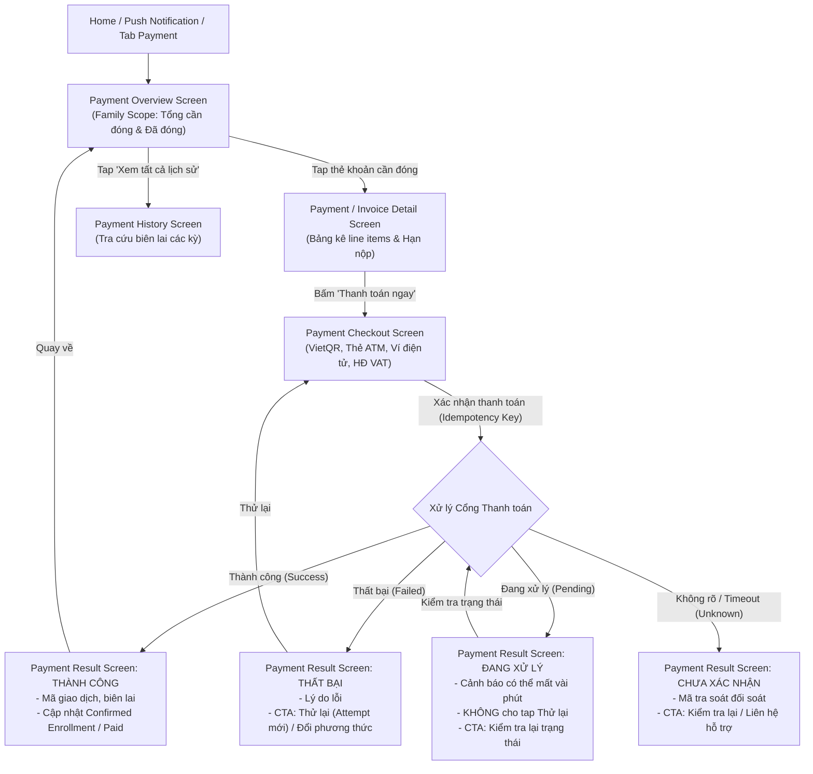

# Kế Hoạch Triển Khai UI Tab Học Phí (Payment Tab & Flow Plan — Ver 1)

> **Căn cứ tài liệu:** [`C:\Users\tungm\Downloads\deliverable.md`](file:///C:/Users/tungm/Downloads/deliverable.md) (Mục A, B, C, D, E, F, G, H)  
> **Phân hệ:** Tab Học phí (`ParentPaymentScreen` / `PaymentOverviewScreen` & luồng thanh toán phụ huynh)  
> **Nhánh Git:** `UI/Parent`  
> **Nguyên tắc cốt lõi:**  
> 1. **Family Scope**: Tab Học phí mang phạm vi toàn gia đình, không đặt `ChildSelector` ở header; mỗi khoản phí tự gắn nhãn avatar và tên của từng con.  
> 2. **Trung thực về dữ liệu**: Không suy diễn số dư, chia rõ 2 nhóm: "Khoản cần đóng" và "Khoản đã đóng kỳ này".  
> 3. **Bảo toàn giao dịch & Idempotency**: Thiết kế màn hình Checkout và Kết quả thanh toán hỗ trợ đủ 4 trạng thái (Success, Failed, Pending, Unknown); chống double-submit và ngăn chặn phụ huynh đóng tiền 2 lần.  
> 4. **Trạng thái ngoại tuyến (Offline)**: Cho phép xem dữ liệu cache nhưng vô hiệu hóa toàn bộ hành động thanh toán.  
> 5. **Chất lượng code**: Linter `flutter analyze` 0 lỗi, commit từng bước bằng tiếng Việt có dấu đầy đủ.

---

## 1. Đối Chiếu Nghiêm Ngặt Với deliverable.md

Theo đặc tả nghiệp vụ tại `deliverable.md`:

| Mục trong spec | Yêu cầu nghiệp vụ | Hiện thực hóa trong thiết kế UI Ver 1 |
|---|---|---|
| **Scope (IA - Mục A/D)** | **Family scope**: Header chỉ có tiêu đề "Học phí", KHÔNG có child selector ở top bar. | Mỗi thẻ hóa đơn mang badge tên con (`Minh · 10A1`, `Lan · 7B`). Cung cấp bộ lọc phụ (filter chips) tùy chọn theo con. |
| **Hierarchy (Mục E - Screen 18)** | 1. Tổng số tiền cần đóng (mọi con, nổi bật nhất).<br>2. Tổng đã đóng kỳ này (thông tin tham khảo).<br>3. Breakdown theo từng con.<br>4. CTA "Xem lịch sử". | 2 thẻ KPI tài chính trên cùng: **TỔNG CẦN THANH TOÁN** (to, đậm, màu cam/xanh nổi bật) và **ĐÃ ĐÓNG KỲ NÀY**. Bên dưới là danh sách thẻ hóa đơn phân nhóm. |
| **Offline State (Mục D)** | Vô hiệu hóa mọi hành động thanh toán khi offline, vẫn cho xem dữ liệu từ cache. | Banner thông báo ngoại tuyến, nút `Thanh toán ngay` và `Pay now` bị disabled kèm tooltip giải thích. |
| **Detail Screen (Mục E - Screen 19)** | Chi tiết line items cấu thành, hạn nộp, trạng thái, sticky CTA dưới cùng. | Bảng kê minh bạch: Học phí chính khóa, giáo trình, phụ phí, ưu đãi/học bổng giảm trừ, tổng tiền cuối cùng. |
| **Checkout (Mục E - Screen 20)** | Chọn phương thức thanh toán, tóm tắt khoản đóng, bước xác nhận trước khi submit, chống double-tap. | Hỗ trợ 4 phương thức phổ biến (VietQR Napas247, Thẻ ATM/iBanking, Ví điện tử MoMo/ZaloPay/VNPay, Thẻ Visa/Mastercard) + Tùy chọn xuất HĐĐT (VAT). |
| **Payment Result (Mục E - Screen 21)** | Xử lý 4 trạng thái chuẩn: Thành công, Thất bại, Đang xử lý (Pending), Không rõ (Unknown). Áp dụng quy tắc Idempotency. | Giao diện chuyên biệt cho từng trạng thái: Pending KHÔNG có nút "Thử lại" (chống trùng giao dịch); Unknown có mã tra soát và liên hệ hỗ trợ. |
| **Payment History (Mục E - Screen 22)** | Tra cứu lịch sử đã đóng, lọc theo con/kỳ học, tải biên lai/hóa đơn cũ. | Danh sách các giao dịch thành công trong quá khứ kèm mã hóa đơn và nút xem/tải biên lai PDF. |

---

## 2. Luồng Người Dùng (User Flows & State Transitions)



---

## 3. Kiến Trúc Thư Mục & Phân Hệ Mã Nguồn

```text
lib/features/parent/
├── data/models/
│   ├── parent_payment_model.dart              <-- InvoiceItem, PaymentMethod, PaymentResultModel, PaymentHistoryModel
│   └── models.dart                            <-- Export payment models
├── repository/
│   ├── parent_payment_repository.dart         <-- Interface: getInvoices, getInvoiceDetail, checkout, checkPaymentStatus, getHistory
│   └── parent_payment_repository_impl.dart    <-- Mock data chuẩn hóa cho gia đình Minh & Lan
└── presentation/payment/
    ├── parent_payment_screen.dart             <-- Root screen: Payment Overview
    ├── payment_invoice_detail_screen.dart     <-- Màn hình chi tiết hóa đơn & line items
    ├── payment_checkout_screen.dart           <-- Màn hình chọn phương thức & thanh toán
    ├── payment_result_screen.dart             <-- Màn hình kết quả giao dịch (4 trạng thái)
    ├── payment_history_screen.dart            <-- Màn hình lịch sử giao dịch đã đóng
    └── widgets/
        ├── payment_summary_cards.dart         <-- 2 Card KPI: Tổng cần thanh toán & Đã đóng
        ├── invoice_item_card.dart             <-- Thẻ khoản phí hiển thị tên con, số tiền, hạn nộp
        ├── payment_method_selector.dart       <-- Bộ chọn phương thức (VietQR, Thẻ, Ví, Quốc tế)
        ├── vietqr_display_card.dart           <-- Khối hiển thị mã QR động VietQR ngân hàng
        ├── vat_invoice_form.dart              <-- Khối nhập thông tin xuất hóa đơn GTGT
        └── payment_empty_card.dart            <-- Trạng thái rỗng không có khoản nợ
```

---

## 4. Chi Tiết Kế Hoạch Triển Khai (Phased Roadmap)

### Giai đoạn 1: Data Models & Payment Repository
- [ ] **Bước 1.1: Tạo `parent_payment_model.dart`:**
  - Enum `PaymentInvoiceStatus`: `unpaid`, `dueSoon`, `overdue`, `paid`, `processing`.
  - Enum `PaymentMethodType`: `vietQr`, `atmCard`, `eWallet`, `creditCard`.
  - Enum `PaymentTransactionStatus`: `success`, `failed`, `pending`, `unknown`.
  - Model `InvoiceLineItem`: Tên mục, đơn giá, số lượng, giảm trừ, thành tiền.
  - Model `ParentInvoiceModel`: ID hóa đơn, childId, childName, className, tiêu đề, mã hóa đơn, ngày phát hành, hạn thanh toán, tổng tiền, danh sách line items, trạng thái.
  - Model `PaymentSummaryOverviewModel`: Tổng tiền cần đóng, số khoản cần đóng, tổng tiền đã đóng kỳ này.
  - Model `PaymentTransactionResult`: Mã giao dịch, invoiceId, childName, số tiền, trạng thái kết quả, thời gian, thông báo lỗi nếu có.
- [ ] **Bước 1.2: Định nghĩa `ParentPaymentRepository` & Implementation:**
  - `Future<PaymentSummaryOverviewModel> getPaymentSummary();`
  - `Future<List<ParentInvoiceModel>> getInvoices({String? childId, PaymentInvoiceStatus? status});`
  - `Future<ParentInvoiceModel?> getInvoiceDetail(String invoiceId);`
  - `Future<PaymentTransactionResult> submitPayment({required String invoiceId, required PaymentMethodType method, String? idempotencyKey, Map<String, dynamic>? vatInfo});`
  - `Future<PaymentTransactionResult> checkPaymentStatus(String transactionId);`
  - `Future<List<ParentInvoiceModel>> getPaymentHistory({String? childId, int? year});`
  - Mock data cho Minh (1 khoản Toán cần nộp gấp, 1 khoản STEM đã đóng) và Lan (1 khoản Tiếng Anh sắp đến hạn).

### Giai đoạn 2: Xây dựng Màn hình Tổng quan Học phí (`PaymentOverviewScreen`)
- [ ] **Bước 2.1: Header Family Scope:**
  - Tiêu đề "Học phí & Thanh toán", không có child selector.
  - Nút biểu tượng Lịch sử thanh toán trên AppBar dẫn tới `PaymentHistoryScreen`.
- [ ] **Bước 2.2: 2 Thẻ KPI Tài chính (`PaymentSummaryCards`):**
  - Thẻ 1 (Trọng tâm): **TỔNG CẦN THANH TOÁN** (nổi bật, số tiền lớn, số khoản cần đóng).
  - Thẻ 2: **ĐÃ ĐÓNG KỲ NÀY** (thông tin tham khảo).
- [ ] **Bước 2.3: Thanh lọc phụ (Filter bar):**
  - Chip lọc theo con: `Tất cả con`, `Minh (10A1)`, `Lan (7B)`.
  - Chip lọc trạng thái: `Cần thanh toán`, `Đã thanh toán`.
- [ ] **Bước 2.4: Danh sách `InvoiceItemCard`:**
  - Hiển thị badge avatar con, tên con + lớp.
  - Tên học phần, hạn nộp, badge trạng thái (`Cần nộp gấp`, `Quá hạn`, `Đã đóng`).
  - Số tiền và nút `Thanh toán ngay` (mở Checkout) hoặc `Chi tiết` (mở Invoice Detail).
- [ ] **Bước 2.5: Trạng thái Empty & Offline:**
  - Khi không có khoản nợ: Hiện card All-clear "Tuyệt vời! Gia đình không có khoản phí nào cần đóng".
  - Khi offline: Hiện banner ngoại tuyến, vô hiệu hóa nút thanh toán.

### Giai đoạn 3: Xây dựng Màn hình Chi tiết Hóa đơn (`PaymentInvoiceDetailScreen`)
- [ ] **Bước 3.1: Header & Thông tin Học sinh:**
  - Header có nút Back.
  - Card định danh học sinh: Tên con, mã học viên, lớp, trường.
- [ ] **Bước 3.2: Bảng kê Line Items minh bạch:**
  - Liệt kê từng khoản chi tiết: Học phí buổi học, giáo trình, phí thi, học bổng giảm trừ (-).
  - Khối tổng kết số tiền cần đóng.
- [ ] **Bước 3.3: Hạn nộp & Chính sách trung tâm:**
  - Hạn chót đóng phí, đếm ngược thời gian.
  - Hướng dẫn hỗ trợ chia kỳ hoặc hoàn phí.
- [ ] **Bước 3.4: Sticky CTA dưới cùng:**
  - Nút nổi bật `[ Thanh toán ngay • X.XXX.000 đ ]` dẫn sang màn Checkout.

### Giai đoạn 4: Xây dựng Màn hình Checkout (`PaymentCheckoutScreen`)
- [ ] **Bước 4.1: Tóm tắt thông tin khoản đóng:**
  - Tên con, tên lớp, số tiền phải trả.
- [ ] **Bước 4.2: Bộ chọn phương thức thanh toán (`PaymentMethodSelector`):**
  - VietQR Napas247 (chuyển khoản ngân hàng tức thì với QR động).
  - Thẻ ATM nội địa / Internet Banking.
  - Ví điện tử MoMo / ZaloPay / VNPay.
  - Thẻ quốc tế Visa / Mastercard.
- [ ] **Bước 4.3: Khối VietQR tương tác (`VietQrDisplayCard`):**
  - Hiển thị mã QR ngân hàng chuẩn VietQR.
  - Thông tin số tài khoản, tên chủ tài khoản, ngân hàng, số tiền, cú pháp chuyển tiền tự động.
  - Nút "Tải mã QR về máy" và nút "Sao chép số tài khoản / nội dung".
- [ ] **Bước 4.4: Khối Tùy chọn Xuất hóa đơn GTGT (`VatInvoiceForm`):**
  - Toggle "Yêu cầu xuất hóa đơn công ty (VAT)".
  - Các ô nhập: Tên công ty, Mã số thuế, Địa chỉ, Email nhận HĐĐT.
- [ ] **Bước 4.5: Cơ chế Idempotency & Sticky Submit:**
  - Khóa nút, hiển thị spinner khi bấm thanh toán, ngăn submit 2 lần.
  - Chuyển hướng sang màn hình Kết quả (`PaymentResultScreen`).

### Giai đoạn 5: Xây dựng Màn hình Kết quả Thanh toán (`PaymentResultScreen`)
- [ ] **Bước 5.1: Xử lý 4 trạng thái chuẩn xác:**
  - **Trạng thái 1: Thành công (Success)** $\rightarrow$ Icon xanh, thông tin giao dịch, CTA `Về trang Học phí` hoặc `Xem biên lai`.
  - **Trạng thái 2: Thất bại (Failed)** $\rightarrow$ Icon đỏ, lý do lỗi, CTA `Thử lại` (tạo attempt mới liên kết attempt cũ) hoặc `Đổi phương thức`.
  - **Trạng thái 3: Đang xử lý (Pending)** $\rightarrow$ Icon đồng hồ cát, thông báo giao dịch đang xử lý, KHÔNG CÓ nút thử lại, chỉ có CTA `Kiểm tra lại trạng thái`.
  - **Trạng thái 4: Chưa xác nhận (Unknown/Timeout)** $\rightarrow$ Mã giao dịch tra soát, CTA `Kiểm tra lại` và `Liên hệ hỗ trợ`.

### Giai đoạn 6: Xây dựng Màn hình Lịch sử Thanh toán (`PaymentHistoryScreen`)
- [ ] **Bước 6.1: Bộ lọc Lịch sử:**
  - Lọc theo con (Tất cả, Minh, Lan) và theo năm học (2024–2025).
- [ ] **Bước 6.2: Danh sách giao dịch hoàn thành:**
  - Thẻ giao dịch hiển thị mã hóa đơn, tên con, ngày thanh toán, số tiền, phương thức.
  - Nút xem chi tiết biên lai và tải file PDF điện tử.

### Giai đoạn 7: Tích hợp Toàn diện & Nghiệm thu Kỹ thuật
- [ ] **Bước 7.1: Đấu nối vào `ParentShell`:** Thay thế placeholder hiện tại bằng `ParentPaymentScreen`.
- [ ] **Bước 7.2: Đấu nối từ `ParentHomeScreen`:** Alert thanh toán quá hạn trên Home tap thẳng vào `PaymentInvoiceDetailScreen`.
- [ ] **Bước 7.3: Kiểm tra chất lượng code:** `flutter analyze` 0 issues (0 lỗi, 0 cảnh báo).
- [ ] **Bước 7.4: Commit theo từng bước bằng tiếng Việt có dấu đầy đủ**, không push lên remote khi chưa có yêu cầu.

---

## 5. Tiêu Chí Nghiệm Thu (Acceptance Criteria)

| Tiêu chí | Điều kiện Đạt (PASS) |
|---|---|
| **Tuân thủ Family Scope** | Không có dropdown chọn con ở header tab Học phí; mỗi thẻ tự hiển thị tên và avatar của con tương ứng. |
| **Tính chân thực của số liệu** | Hiển thị rõ ràng 2 số tổng: Tổng cần thanh toán (của mọi con) và Tổng đã đóng kỳ này; phân loại chuẩn xác trạng thái quá hạn / sắp đến hạn. |
| **Bảo toàn Idempotency** | Không có tình trạng tap đúp nút thanh toán; màn hình Pending không hiển thị nút thử lại thanh toán; mã attempt được lưu vết rõ ràng. |
| **Hỗ trợ VietQR thực tế** | Có mã QR động, sao chép nhanh STK và cú pháp chuyển tiền mang mã hóa đơn. |
| **Chất lượng mã nguồn** | Không có lỗi compile, không có cảnh báo analyzer, responsive trên mọi kích thước màn hình. |
